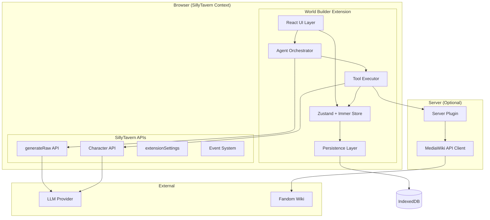
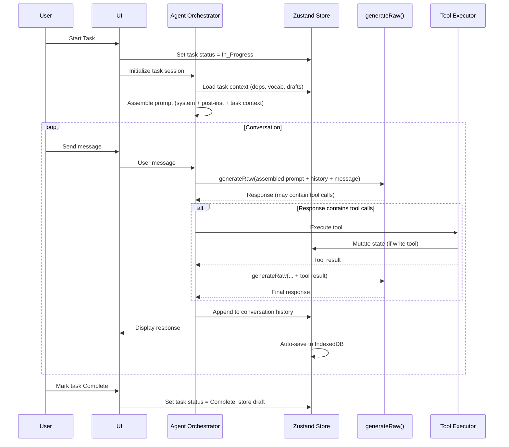
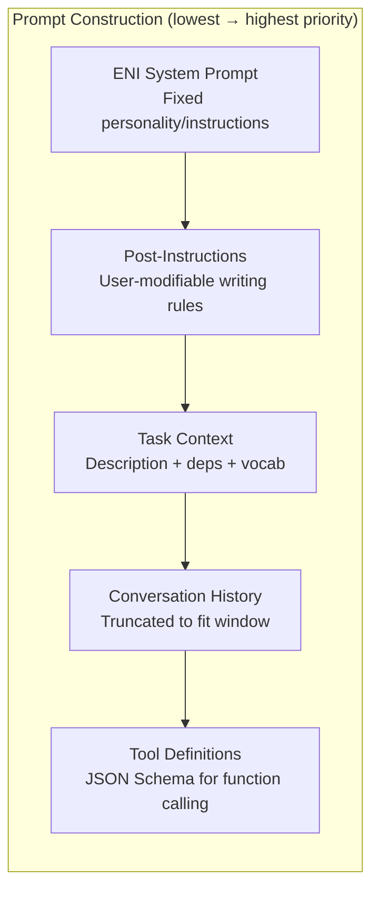
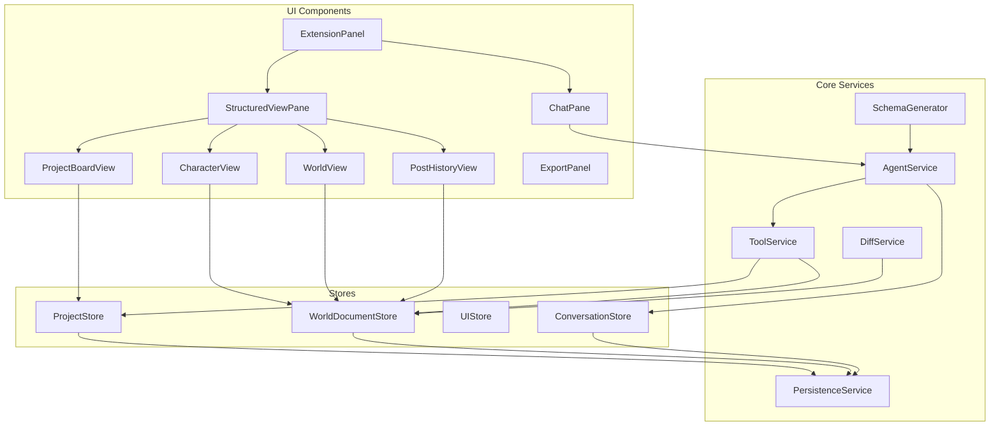
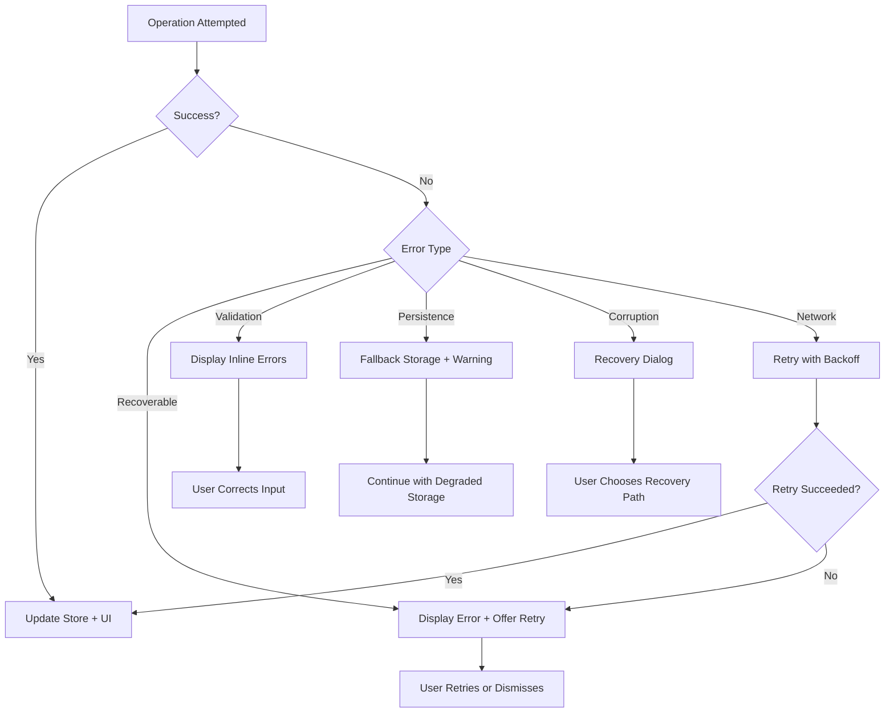

# Design Document: SillyTavern World Builder

## Overview

The SillyTavern World Builder is a bundled React extension that provides an agentic workflow for building character cards, world information, and post-history instructions. The extension embeds an AI agent (ENI) that collaborates with users through a structured planning → task execution → export pipeline, producing composable content conforming to the TavernCard V2 specification.

The system is architected around three core principles:
1. **Token-efficient task decomposition** — Work is split into discrete tasks with independent sessions, each pulling only the context it needs from persistent storage rather than carrying everything in one conversation.
2. **Composable format system** — No fixed templates. Users select which components they need from a vocabulary of building blocks, and ENI fills them with quality content.
3. **Parallel execution with isolation** — Multiple `generateRaw()` calls can run simultaneously without shared mutable state conflicts, enabling concurrent task work.

The extension operates as a client-side React application bundled via Webpack, with an optional server plugin for MediaWiki API access. It communicates with the LLM exclusively through SillyTavern's `generateRaw()` API, maintaining complete separation from the user's normal RP chat.

## Architecture

### High-Level Architecture Diagram



### Layer Responsibilities

| Layer | Responsibility |
|-------|---------------|
| **UI Layer** | React components (shadcn/ui), view routing, user input handling, real-time display updates |
| **Store Layer** | Zustand stores with Immer middleware — world document, project state, UI state, conversation history |
| **Agent Orchestrator** | Prompt construction (hierarchy assembly), `generateRaw()` invocation, response parsing, tool call dispatch |
| **Tool Executor** | Implements ENI's 7 tools — routes calls to ST APIs, store mutations, or server plugin |
| **Persistence Layer** | localforage (IndexedDB) for large data, extensionSettings for metadata, auto-save with debounce |
| **Server Plugin** | Express routes for MediaWiki API proxy, wikitext parsing via wtf_wikipedia, HTML extraction via cheerio |

### Data Flow: Task Execution



### Prompt Hierarchy Assembly



Priority resolution: When instructions conflict, later layers override earlier ones. Post-instructions override ENI's card. Task context provides the specific work scope.

## Components and Interfaces

### Component Diagram



### Key Interfaces

#### AgentService

```typescript
interface AgentService {
  /** Start a new task session, loading context from dependencies */
  initializeSession(taskId: string): Promise<void>;
  
  /** Send a user message and get ENI's response (may involve tool calls) */
  sendMessage(message: string): Promise<AgentResponse>;
  
  /** Cancel an in-progress generation */
  cancelGeneration(): void;
  
  /** Get the assembled prompt for debugging/preview */
  getAssembledPrompt(taskId: string): PromptLayers;
}

interface AgentResponse {
  content: string;
  toolCalls?: ToolCallResult[];
  metadata: {
    tokensUsed: number;
    generationTime: number;
  };
}

interface PromptLayers {
  systemPrompt: string;
  postInstructions: string;
  taskContext: string;
  conversationHistory: ConversationMessage[];
  toolDefinitions: ToolDefinition[];
}
```

#### ToolService

```typescript
interface ToolService {
  /** Execute a tool call from ENI's response */
  executeTool(call: ToolCall): Promise<ToolResult>;
  
  /** Get tool definitions as JSON Schema for prompt injection */
  getToolDefinitions(): ToolDefinition[];
}

interface ToolCall {
  name: 'search_wiki' | 'get_wiki_page' | 'read_character' | 'write_character' | 'create_character' | 'get_world_state' | 'update_world_state';
  arguments: Record<string, unknown>;
}

interface ToolResult {
  success: boolean;
  data?: unknown;
  error?: string;
}

interface ToolDefinition {
  name: string;
  description: string;
  parameters: JSONSchema;
}
```

#### PersistenceService

```typescript
interface PersistenceService {
  /** Save a value to IndexedDB */
  save<T>(key: string, value: T): Promise<void>;
  
  /** Load a value from IndexedDB */
  load<T>(key: string): Promise<T | null>;
  
  /** Delete a value from IndexedDB */
  remove(key: string): Promise<void>;
  
  /** List all keys matching a prefix */
  listKeys(prefix: string): Promise<string[]>;
  
  /** Check storage availability and capacity */
  getStorageStatus(): Promise<StorageStatus>;
}

interface StorageStatus {
  available: boolean;
  backend: 'indexeddb' | 'localstorage' | 'memory';
  usedBytes?: number;
  quotaBytes?: number;
}
```

#### DiffService

```typescript
interface DiffService {
  /** Compute diff between two states */
  diff<T>(left: T, right: T): Delta | undefined;
  
  /** Apply a diff to produce new state */
  patch<T>(state: T, delta: Delta): T;
  
  /** Reverse a diff */
  unpatch<T>(state: T, delta: Delta): T;
  
  /** Get human-readable change summary */
  formatDiff(delta: Delta): DiffSummary[];
}
```

#### SchemaGenerator

```typescript
interface SchemaGenerator {
  /** Generate a JSON Schema from selected component vocabulary */
  generateSchema(components: ComponentSelection): JSONSchema;
  
  /** Validate data against a generated schema */
  validate(data: unknown, schema: JSONSchema): ValidationResult;
}

interface ComponentSelection {
  type: 'character' | 'world' | 'post_history';
  selectedComponents: string[];
  options?: Record<string, unknown>;
}
```

### Store Interfaces

#### ProjectStore

```typescript
interface ProjectStore {
  // State
  projects: Project[];
  activeProjectId: string | null;
  
  // Actions
  createProject(name: string): Project;
  loadProject(id: string): void;
  deleteProject(id: string): Promise<void>;
  updateProject(id: string, changes: Partial<Project>): void;
  
  // Task actions
  addTask(projectId: string, task: TaskDefinition): Task;
  updateTaskStatus(taskId: string, status: TaskStatus): void;
  getTaskDrafts(taskIds: string[]): Record<string, unknown>;
  setTaskDraft(taskId: string, draft: unknown): void;
}
```

#### WorldDocumentStore

```typescript
interface WorldDocumentStore {
  // State
  document: WorldDocument | null;
  characters: CharacterDraft[];
  postHistory: PostHistoryConfig | null;
  undoStack: Delta[];
  redoStack: Delta[];
  
  // Actions
  updateSection(path: string[], value: unknown): void;
  addNode(parentPath: string[], node: WorldNode): void;
  removeNode(path: string[]): void;
  moveNode(fromPath: string[], toPath: string[]): void;
  
  // Character actions
  updateCharacter(id: string, changes: Partial<CharacterDraft>): void;
  importCharacter(stCharacter: TavernCardV2): CharacterDraft;
  
  // Undo/Redo
  undo(): void;
  redo(): void;
  
  // Post-history actions
  updatePostHistoryTile(tileId: string, config: unknown): void;
  togglePostHistoryTile(tileId: string, enabled: boolean): void;
}
```

#### UIStore

```typescript
interface UIStore {
  // State
  panelOpen: boolean;
  panelWidth: number;
  activeView: 'project' | 'character' | 'world' | 'post_history';
  selectedTreeNode: string | null;
  selectedTaskId: string | null;
  
  // Actions
  togglePanel(): void;
  setActiveView(view: string): void;
  selectTreeNode(nodeId: string | null): void;
  selectTask(taskId: string | null): void;
}
```

#### ConversationStore

```typescript
interface ConversationStore {
  // State
  conversations: Record<string, ConversationMessage[]>;
  activeConversationId: string | null;
  isGenerating: boolean;
  
  // Actions
  appendMessage(conversationId: string, message: ConversationMessage): void;
  setGenerating(generating: boolean): void;
  loadConversation(conversationId: string): void;
  clearConversation(conversationId: string): void;
}
```

### Server Plugin API

```typescript
// Express routes exposed by the optional server plugin
// Base path: /api/plugins/world-builder

interface WikiSearchRequest {
  query: string;
  wiki: string; // e.g., "finalfantasy" for finalfantasy.fandom.com
  limit?: number;
}

interface WikiPageRequest {
  title: string;
  wiki: string;
  sections?: string[]; // Optional: only return specific sections
}

// GET /api/plugins/world-builder/wiki/search?query=...&wiki=...&limit=...
// GET /api/plugins/world-builder/wiki/page?title=...&wiki=...
// GET /api/plugins/world-builder/wiki/categories?wiki=...&category=...
// GET /api/plugins/world-builder/status (health check)
```

## Data Models

### Project

```typescript
interface Project {
  id: string;              // nanoid
  name: string;
  createdAt: number;       // Unix timestamp
  updatedAt: number;
  plan: ProjectPlan | null;
  tasks: Task[];
  worldDocumentId: string; // Reference to WorldDocument in IndexedDB
  settings: ProjectSettings;
}

interface ProjectPlan {
  description: string;     // User/ENI-authored plan text
  goals: string[];
  componentSelections: ComponentSelection[];
}

interface ProjectSettings {
  postInstructions: string;  // User-modifiable post-instructions
  wikiUrl?: string;          // Configured wiki for this project
  tokenBudget?: number;      // Max tokens per field
}
```

### Task

```typescript
interface Task {
  id: string;              // nanoid
  projectId: string;
  type: 'character' | 'world' | 'post_history' | 'planning' | 'custom';
  title: string;
  description: string;
  status: TaskStatus;
  dependencies: string[];  // Task IDs this task depends on
  componentSelection: ComponentSelection;
  conversationId: string;  // Reference to conversation history
  draft: unknown | null;   // Output of this task (type depends on task type)
  createdAt: number;
  updatedAt: number;
}

type TaskStatus = 'planned' | 'in_progress' | 'complete' | 'needs_revision';
```

### WorldDocument

```typescript
interface WorldDocument {
  id: string;
  projectId: string;
  version: number;
  domains: Record<string, WorldDomain>;
}

interface WorldDomain {
  id: string;
  type: 'geography' | 'politics' | 'factions' | 'lore' | 'relationships' | 'timeline' | 'entities' | 'culture' | 'economy';
  label: string;
  children: WorldNode[];
}

interface WorldNode {
  id: string;
  label: string;
  content: string;         // Prose content for this node
  metadata?: Record<string, unknown>;
  children?: WorldNode[];  // Nested sub-nodes
}
```

### CharacterDraft

```typescript
interface CharacterDraft {
  id: string;
  projectId: string;
  taskId: string;
  importedFrom?: string;   // ST character ID if editing existing
  
  // Component data (only populated for selected components)
  identity?: IdentityComponent;
  psychology?: PsychologyComponent;
  role?: RoleComponent;
  relationships?: RelationshipComponent[];
  behavior?: BehaviorComponent;
  context?: ContextComponent;
  romance?: RomanceComponent;
  
  // Assembled output fields
  assembledDescription?: string;
  assembledSystemPrompt?: string;
  assembledPostHistory?: string;
}

interface IdentityComponent {
  name: string;
  title?: string;
  formsOfAddress?: string[];
  age?: string;
  height?: string;
  physicalAttributes?: string;
  attire?: string;
}

interface PsychologyComponent {
  mbti: string;            // Required: e.g., "INTJ"
  enneagram: string;       // Required: e.g., "5w6"
  personality: string[];   // Surface-level trait descriptors
  emotions?: string;
  mentality?: string;
  moralsAndEthics?: string;
  likes?: string[];
  dislikes?: string[];
  triggers?: string[];
  attachmentStyle?: string;
}

interface RoleComponent {
  occupation?: string;
  duties?: string;
  skills?: string[];
  responsibilities?: string;
}

interface RelationshipComponent {
  targetName: string;
  dynamic: string;         // Card-voice description of the relationship
  attitude: string;
}

interface BehaviorComponent {
  generalBehavior?: string;
  generalSpeech?: string;
  combatStyle?: string;
  weapons?: string[];
}

interface ContextComponent {
  backstory?: string;
  [key: string]: string | undefined; // Dynamic fields: conflict_x, as_role, etc.
}

interface RomanceComponent {
  romance?: string;
  sexualDisposition?: string;
  preferences?: string;
}
```

### PostHistoryConfig

```typescript
interface PostHistoryConfig {
  id: string;
  projectId: string;
  taskId: string;
  
  tiles: PostHistoryTile[];
  assembledOutput?: string; // Live preview of assembled post-history
}

interface PostHistoryTile {
  id: string;
  type: 'header' | 'body' | 'length' | 'endings' | 'footer' | 'timeline' | 'example';
  enabled: boolean;
  label: string;
  config: unknown;         // Type-specific configuration
}

// Type-specific configs
interface HeaderTileConfig {
  format: string;          // Template string with {variables}
  variables: Record<string, VariableDefinition>;
}

interface BodyTileConfig {
  format: string;
  pov: string;
  drafting?: string;
}

interface LengthTileConfig {
  rules: LengthRule[];
}

interface LengthRule {
  condition: string;
  range: string;           // e.g., "100-120 words"
}

interface EndingsTileConfig {
  conventions: Record<string, string>; // scene_type → ending rule
}

interface FooterTileConfig {
  format: string;
  variables: Record<string, VariableDefinition>;
}

interface TimelineTileConfig {
  events: TimelineEvent[];
}

interface TimelineEvent {
  trigger: string;
  check: string;
  outcomeMet: string;
  outcomeNotMet: string;
}

interface VariableDefinition {
  type?: string;
  values?: string[];
  logic: string;
  initial?: unknown;
}
```

### ConversationMessage

```typescript
interface ConversationMessage {
  id: string;
  role: 'user' | 'assistant' | 'system' | 'tool_call' | 'tool_result';
  content: string;
  timestamp: number;
  metadata?: {
    toolCall?: ToolCall;
    toolResult?: ToolResult;
    tokensUsed?: number;
  };
}
```

### Tool Call Display Cards

Tool calls in the ENI chat pane are rendered as compact, styled cards (not raw JSON). Each card shows:
- An icon indicating the tool type (🔍 search, 📝 write, 📖 read, 🌐 wiki, ➕ create)
- A short human-readable summary of what was done (e.g., "Searched wiki: berserk.fandom.com", "Updated character: Darlene → Psychology")
- Expandable detail section (click to see full parameters/results)
- Status indicator (success ✓, error ✗, in-progress spinner)

```typescript
interface ToolCallCardProps {
  toolName: string;
  summary: string;           // Human-readable one-liner
  icon: string;              // Emoji or icon class
  status: 'pending' | 'success' | 'error';
  parameters?: Record<string, unknown>;  // Expandable detail
  result?: unknown;                       // Expandable result
  timestamp: number;
}

// Summary generation per tool:
// search_wiki    → "🔍 Searched wiki: {wiki} for '{query}'"
// get_wiki_page  → "🌐 Fetched page: {title} from {wiki}"
// read_character → "📖 Read character: {characterName}"
// write_character→ "📝 Updated character: {characterName} → {fieldsChanged}"
// create_character→"➕ Created character: {name}"
// get_world_state→ "📖 Read world state: {section or 'full document'}"
// update_world_state→"📝 Updated world: {path}"
```

These cards appear inline in the chat flow between ENI's text messages, similar to how IDE tool calls appear as compact status boxes. They keep the chat readable while providing full transparency into what ENI is doing.

### TavernCard V2 Export

```typescript
interface TavernCardV2Export {
  spec: 'chara_card_v2';
  spec_version: '2.0';
  data: {
    name: string;
    description: string;
    personality: string;
    scenario: string;
    first_mes: string;
    mes_example: string;
    creator_notes: string;
    system_prompt: string;
    post_history_instructions: string;
    alternate_greetings: string[];
    character_book?: CharacterBook;
    tags: string[];
    creator: string;
    character_version: string;
    extensions: {
      world_builder?: {
        projectId: string;
        worldDocument: WorldDocument;
        componentSelections: ComponentSelection[];
        version: string;
      };
      [key: string]: unknown;
    };
  };
}
```

### IndexedDB Storage Schema

```
world-builder-projects/
  ├── project:{id}          → Project (without large nested data)
  ├── world:{projectId}     → WorldDocument
  ├── conversation:{taskId} → ConversationMessage[]
  ├── draft:{taskId}        → Task draft output
  ├── diff-history:{projectId} → Delta[] (undo stack)
  └── metadata              → { lastProjectId, version, ... }
```

## Correctness Properties

*A property is a characteristic or behavior that should hold true across all valid executions of a system — essentially, a formal statement about what the system should do. Properties serve as the bridge between human-readable specifications and machine-verifiable correctness guarantees.*

### Property 1: Persistence Round-Trip

*For any* valid project state (including world documents, conversation histories, task drafts, and project metadata), serializing to IndexedDB via localforage and then deserializing back into the Zustand store SHALL produce a state equivalent to the original.

**Validates: Requirements 2.2, 2.3, 3.3, 15.2**

### Property 2: Project Deletion Completeness

*For any* project with associated tasks, drafts, world documents, and conversation histories, deleting that project SHALL result in zero keys remaining in IndexedDB that reference that project's ID.

**Validates: Requirements 2.4**

### Property 3: Schema Generation Correctness

*For any* component selection (character, world, or post-history type), the generated JSON schema SHALL contain properties for exactly the selected components and no others, and if the selection includes the psychology component, the schema SHALL require both `mbti` and `enneagram` fields.

**Validates: Requirements 4.4, 4.5**

### Property 4: Task State Machine Validity

*For any* task in any state, only the following transitions SHALL be permitted: `planned → in_progress`, `in_progress → complete`, `in_progress → needs_revision`, `needs_revision → in_progress`, `complete → needs_revision`. All other transitions SHALL be rejected.

**Validates: Requirements 5.2**

### Property 5: Dependency Graph Invariants

*For any* task with declared dependencies, the task SHALL not be startable (transition to `in_progress`) unless all dependency tasks have status `complete`. Conversely, when a task transitions to `complete`, all tasks that depend solely on it SHALL become startable.

**Validates: Requirements 5.5, 10.4**

### Property 6: Parallel Task Isolation

*For any* two tasks executing concurrently (both `in_progress`), mutations applied to one task's conversation history, draft, or local state SHALL not affect the other task's conversation history, draft, or local state.

**Validates: Requirements 5.7**

### Property 7: World Document Tree Mutations

*For any* valid world document and any add or remove operation on its tree structure: (a) adding a node at a path SHALL result in that node being retrievable at that path, and (b) removing a node at a path SHALL result in that node no longer being retrievable at that path, with all other nodes unchanged.

**Validates: Requirements 6.6, 8.3, 8.4**

### Property 8: Post-History Assembly Composition

*For any* set of post-history tiles with arbitrary enable/disable configurations, the assembled output string SHALL contain content from all and only the enabled tiles, in their defined order.

**Validates: Requirements 9.2**

### Property 9: Prompt Assembly Correctness

*For any* task session with a system prompt, post-instructions, task context, conversation history, and tool definitions, the assembled prompt SHALL: (a) contain all layers in the order system → post-instructions → task context → history → tools, (b) include the task description, dependent task drafts, and component vocabulary in the task context layer, and (c) have total token count not exceeding the model's context window, with oldest conversation messages truncated first when necessary.

**Validates: Requirements 3.1, 13.1, 13.2, 13.5**

### Property 10: Character Card Export Conformance

*For any* valid set of character components (identity, psychology, role, relationships, behavior, context, romance) and post-history configuration, assembling into a TavernCard V2 export SHALL produce a JSON object that conforms to the TavernCard V2 schema with `spec: 'chara_card_v2'`, `spec_version: '2.0'`, and all required fields populated.

**Validates: Requirements 11.1**

### Property 11: Token Budget Validation

*For any* assembled character card where at least one field's token count exceeds the configured token budget, the validation function SHALL return warnings identifying exactly the fields that exceed their budget.

**Validates: Requirements 11.5**

### Property 12: Character Import Parsing

*For any* valid TavernCard V2 character card, parsing into the Component_Vocabulary structure SHALL produce a valid component structure where all non-empty V2 fields are mapped to their corresponding component fields, and re-assembling back to V2 format SHALL preserve the semantic content.

**Validates: Requirements 12.2**

### Property 13: Diff Patch Round-Trip

*For any* two valid character states (original and modified), computing a diff with jsondiffpatch and then applying that diff to the original SHALL produce a state equal to the modified state. Conversely, unpatching the modified state with the same diff SHALL produce the original state.

**Validates: Requirements 12.4**

### Property 14: Minimal Field Write

*For any* original character state and modified character state, the set of fields included in the API write payload SHALL be exactly the set of fields whose values differ between original and modified — no unchanged fields SHALL be included.

**Validates: Requirements 12.5**

### Property 15: Undo/Redo Consistency

*For any* sequence of N mutations applied to a world document, performing N undo operations SHALL restore the document to its initial state, and subsequently performing N redo operations SHALL restore it to the state after all N mutations. Additionally, for any single undo operation, the resulting state SHALL equal the state immediately before the last mutation.

**Validates: Requirements 15.3, 15.4**

## Error Handling

### Error Categories and Strategies

| Category | Source | Strategy | User Impact |
|----------|--------|----------|-------------|
| **Generation Failure** | `generateRaw()` network error, timeout, or malformed response | Catch error, display in chat pane, preserve user message for retry | User sees error message with "Retry" button; no data loss |
| **Tool Execution Failure** | ST API errors (character not found, permission denied), store mutation errors | Return error result to agent loop; ENI can acknowledge and retry or inform user | ENI reports the issue in chat; user can intervene |
| **Persistence Failure** | IndexedDB quota exceeded, unavailable, or write error | Fall back to localStorage for critical metadata; queue failed writes for retry | Warning toast; reduced storage capacity notice |
| **Schema Validation Error** | Invalid data from ENI's structured output, user input that fails Zod validation | Display inline validation errors; reject invalid mutations to store | Red inline errors on affected fields; store remains consistent |
| **Server Plugin Unavailable** | Plugin not installed, server unreachable, or endpoint error | Gracefully degrade wiki tools; inform user via tool result | ENI reports wiki unavailable; all other features work |
| **Data Corruption** | Malformed data in IndexedDB (version mismatch, partial write) | Detect via Zod validation on load; offer recovery or fresh start | Error dialog with "Create New Project" option |
| **Rate Limiting** | MediaWiki API 429 responses | Server plugin queues request, retries after `Retry-After` header | Transparent to user; slight delay on wiki results |
| **Context Window Overflow** | Assembled prompt exceeds model's context limit | Truncate oldest conversation messages; warn if task context alone exceeds limit | Older messages fade from context; warning if task is too large |

### Error Handling Flow



### Specific Error Scenarios

#### generateRaw() Failure
```typescript
try {
  const response = await generateRaw(assembledPrompt, options);
  // Parse and process response
} catch (error) {
  if (error.name === 'AbortError') {
    // User cancelled — no action needed
    return;
  }
  conversationStore.appendMessage(taskId, {
    role: 'system',
    content: `Generation failed: ${error.message}. Click retry to try again.`,
    metadata: { retryable: true, originalMessage: userMessage }
  });
  uiStore.setGenerating(false);
}
```

#### Structured Output Parse Failure
When ENI's response doesn't conform to the expected JSON schema for tool calls:
1. Attempt lenient parsing (strip markdown fences, fix common JSON errors)
2. If still invalid, treat the entire response as plain text (no tool execution)
3. Display the response to the user with a note that structured output failed
4. ENI can be re-prompted with a correction instruction

#### IndexedDB Fallback Chain
```
IndexedDB (primary) → localStorage (fallback, metadata only) → in-memory (last resort)
```
- On each save attempt, try IndexedDB first
- If IndexedDB throws (QuotaExceededError, SecurityError), fall back to localStorage for project metadata only (IDs, names, timestamps)
- Display persistent warning: "Storage limited — large world documents may not persist"
- Never silently lose data — always inform the user

#### Data Migration on Version Mismatch
```typescript
interface StoredMetadata {
  version: string;  // Extension version that wrote this data
  schemaVersion: number;  // Data schema version
}

// On load:
if (stored.schemaVersion < CURRENT_SCHEMA_VERSION) {
  const migrated = runMigrations(stored.data, stored.schemaVersion, CURRENT_SCHEMA_VERSION);
  await persistence.save(key, { ...migrated, schemaVersion: CURRENT_SCHEMA_VERSION });
}
```

## Testing Strategy

### Testing Approach

The testing strategy uses a dual approach combining property-based tests for universal correctness guarantees with example-based unit tests for specific scenarios and integration points.

**Property-Based Testing Library:** [fast-check](https://github.com/dubzzz/fast-check) (TypeScript, integrates with Vitest)

**Test Runner:** Vitest (aligned with Webpack/TypeScript toolchain)

### Property-Based Tests

Each correctness property from the design document is implemented as a property-based test with minimum 100 iterations. Properties test the pure logic layer (store mutations, schema generation, prompt assembly, diff operations) without requiring browser or DOM.

| Property | Test File | Key Generators |
|----------|-----------|----------------|
| 1: Persistence Round-Trip | `persistence.property.test.ts` | Arbitrary project states, world documents, conversation histories |
| 2: Deletion Completeness | `persistence.property.test.ts` | Random projects with varying task/draft counts |
| 3: Schema Generation | `schema.property.test.ts` | Random component selections from vocabulary |
| 4: Task State Machine | `task-state.property.test.ts` | Random states × all possible transitions |
| 5: Dependency Graph | `dependency.property.test.ts` | Random DAGs of tasks with varying completion states |
| 6: Parallel Isolation | `parallel.property.test.ts` | Concurrent mutation sequences on separate tasks |
| 7: World Document Mutations | `world-document.property.test.ts` | Random tree structures × add/remove operations |
| 8: Post-History Assembly | `post-history.property.test.ts` | Random tile configurations × enable/disable states |
| 9: Prompt Assembly | `prompt.property.test.ts` | Random prompt layers × conversation lengths × context windows |
| 10: Export Conformance | `export.property.test.ts` | Random character component data |
| 11: Token Budget | `export.property.test.ts` | Random field sizes × budget configurations |
| 12: Character Import | `import.property.test.ts` | Random valid TavernCard V2 structures |
| 13: Diff Round-Trip | `diff.property.test.ts` | Random JSON objects × random modifications |
| 14: Minimal Field Write | `diff.property.test.ts` | Random original/modified character pairs |
| 15: Undo/Redo | `undo-redo.property.test.ts` | Random mutation sequences of varying length |

**Configuration:**
```typescript
// vitest.config.ts — property test settings
fc.configureGlobal({ numRuns: 100 });
```

**Tag format for each test:**
```typescript
// Feature: sillytavern-world-builder, Property 1: Persistence Round-Trip
it.prop([arbitraryProjectState()], (state) => { ... });
```

### Unit Tests (Example-Based)

Unit tests cover specific scenarios, edge cases, integration points, and UI behavior that property tests don't address.

| Area | Test Focus | Examples |
|------|-----------|----------|
| **Store initialization** | Default state correctness | Empty arrays, null active project |
| **UI rendering** | Component structure, conditional display | Panel renders two panes, character view shows selected components |
| **Tool execution** | ST API integration (mocked) | read_character returns correct data, write_character calls correct endpoint |
| **Error handling** | Specific failure modes | Network timeout shows retry button, corrupted data shows recovery dialog |
| **Theme adaptation** | CSS variable updates on theme change | Variables update when ST theme event fires |
| **Component vocabulary** | Correct options per task type | Character task shows character components, world task shows world components |

### Integration Tests

Integration tests verify the extension works correctly within the SillyTavern context (mocked).

| Scenario | What's Tested |
|----------|---------------|
| Full task lifecycle | Create project → plan → start task → generate → complete → export |
| Character import → edit → apply | Load existing character → modify via ENI → diff review → write back |
| Wiki tool flow | ENI invokes search_wiki → server plugin responds → results displayed |
| Persistence recovery | Save state → simulate page refresh → verify state restored |
| Concurrent tasks | Two tasks in_progress → mutations don't interfere |

### Test Infrastructure

```
tests/
├── property/                    # Property-based tests
│   ├── generators/              # Custom fast-check arbitraries
│   │   ├── project.gen.ts       # Project, Task, Plan generators
│   │   ├── world-document.gen.ts # WorldDocument, WorldNode generators
│   │   ├── character.gen.ts     # CharacterDraft, V2 card generators
│   │   ├── post-history.gen.ts  # PostHistoryConfig generators
│   │   └── prompt.gen.ts        # Prompt layer generators
│   ├── persistence.property.test.ts
│   ├── schema.property.test.ts
│   ├── task-state.property.test.ts
│   ├── dependency.property.test.ts
│   ├── parallel.property.test.ts
│   ├── world-document.property.test.ts
│   ├── post-history.property.test.ts
│   ├── prompt.property.test.ts
│   ├── export.property.test.ts
│   ├── import.property.test.ts
│   ├── diff.property.test.ts
│   └── undo-redo.property.test.ts
├── unit/                        # Example-based unit tests
│   ├── stores/
│   ├── services/
│   ├── components/
│   └── tools/
├── integration/                 # End-to-end flows (mocked ST context)
│   ├── task-lifecycle.test.ts
│   ├── character-edit.test.ts
│   └── persistence-recovery.test.ts
└── mocks/                       # Shared mocks
    ├── st-context.mock.ts       # SillyTavern getContext() mock
    ├── generate-raw.mock.ts     # generateRaw() mock
    ├── indexeddb.mock.ts        # fake-indexeddb for persistence tests
    └── server-plugin.mock.ts    # Wiki endpoint mocks
```

### Key Testing Decisions

1. **fast-check over other PBT libraries** — Native TypeScript, excellent Vitest integration, rich built-in arbitraries, active maintenance.
2. **fake-indexeddb for persistence tests** — Allows property tests to run in Node.js without a browser, testing the actual localforage → IndexedDB path.
3. **Mocked ST context** — The extension depends on `SillyTavern.getContext()` which isn't available in test. A mock provides the required API surface.
4. **No E2E browser tests in v1** — The extension runs inside ST's DOM which makes Playwright/Cypress impractical. Integration tests with mocked context provide sufficient confidence.
5. **Generators mirror data models** — Each data model type has a corresponding fast-check arbitrary that produces valid instances, ensuring property tests exercise realistic data shapes.

